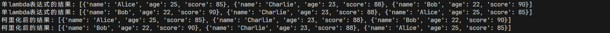

## 1. 按要求实现自定义排序
```python
student = [
    {"name": "Alice", "age": 25, "score": 85},
    {"name": "Bob", "age": 22, "score": 90},
    {"name": "Charlie", "age": 23, "score": 88}
]

# 使用lambda表达式实现自定义函数
def custom_sort(data, key):
    return sorted(data, key=lambda x: x[key])  # 使用 lambda 表达式根据 key 排序

# 使用 functools.partial 函数实现自定义函数
from functools import partial
custom_sort_one = partial(custom_sort, student)  # 创建的自定义函数

# 根据成绩排序
sorted_by_score = custom_sort(student, key="score")
print(f"单lambda表达式的结果: {sorted_by_score}")

# 根据年龄排序
sorted_by_age = custom_sort(student, key="age")
print(f"单lambda表达式的结果: {sorted_by_age}")

# 根据成绩排序
sorted_by_score = custom_sort_one(key="score")
print(f"柯里化后的结果: {sorted_by_score}")

# 根据年龄排序
sorted_by_age = custom_sort_one(key="age")
print(f"柯里化后的结果: {sorted_by_age}")
```
- 程序运行截图
