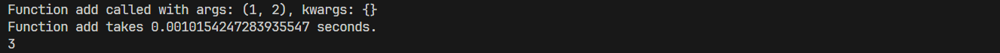

## 2. 编写两个装饰器`@log_time`和`@log_args`，分别用于记录函数的执行时间和参数，然后，将这两个装饰器同时应用到一个函数上
```python
import time
from typing import Any, Callable
from functools import wraps

def log_time(func: Callable) -> Callable:
    @wraps(func)
    def wrapper(*args, **kwargs):
        start = time.time()
        result = func(*args, **kwargs)
        end = time.time()
        print(f'Function {func.__name__} takes {end - start} seconds.')
        return result
    return wrapper

def log_args(func: Callable) -> Callable:
    @wraps(func)
    def wrapper(*args, **kwargs):
        print(f'Function {func.__name__} called with args: {args}, kwargs: {kwargs}')
        return func(*args, **kwargs)
    return wrapper

@log_time
@log_args
def add(x, y):
    return x + y

print(add(1, 2))
```
- 程序运行截图
