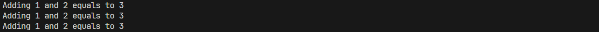

## 3. 请编写一个装饰器`@repeat(n)`，它可以接受一个参数`n`，并让被装饰的函数重复执行`n`次
```python
from functools import wraps

def repeat(n):
    def decorator(func):
        @wraps(func)
        def wrapper(*args, **kwargs):
            for _ in range(n):
                result = func(*args, **kwargs)
            return result
        return wrapper
    return decorator

@repeat(3)
def add(x, y):
    print(f"Adding {x} and {y} equals to {x + y}")
    return x + y

add(1, 2)  # 重复调用3次
```
- 程序运行截图
