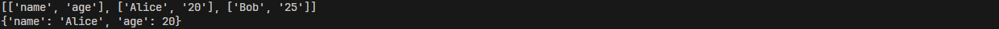

## 4. 接口与类型检查
```python
from typing import Protocol, List


class DataTransformer(Protocol):
    def transform(self, data: str) -> str:
        pass


class CSVTransformer(DataTransformer):
    def transform(self, data: str) -> List[List[str]]:
        import csv
        reader = csv.reader(data.splitlines())
        return [row for row in reader]


class JSONTransformer(DataTransformer):
    def transform(self, data: str) -> str:
        import json
        return json.loads(data)
    

def apply_transformation(transformer: DataTransformer, data: str) -> str:
    return transformer.transform(data)


# 测试代码
csv_data = "name,age\nAlice,20\nBob,25"
json_data = '{"name": "Alice", "age": 20}'

csv_transformer = CSVTransformer()
json_transformer = JSONTransformer()

print(apply_transformation(csv_transformer, csv_data))  # 输出：[['name', 'age'], ['Alice', '20'], ['Bob', '25']]
print(apply_transformation(json_transformer, json_data))  # 输出：{'name': 'Alice', 'age': 20}
```
- 程序运行截图


