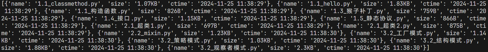

## 1. 文件扫描器 - 实现一个函数，返回指定目录下所有文件的名称、大小和创建时间，以列表字典形式返回
```python
import os
import time


def get_dir_info(dir_path):
    files = os.listdir(dir_path)

    # 获取指定目录下所有文件的名称、大小和格式化创建时间，以列表字典形式返回
    file_info = []
    for file in files:
        file_path = os.path.join(dir_path, file)
        file_size = os.path.getsize(file_path)
        file_ctime = os.path.getctime(file_path)
        # 格式化时间
        file_ctime = time.strftime("%Y-%m-%d %H:%M:%S", time.localtime(file_ctime))
        # 格式化文件大小
        if file_size < 1024:
            file_size = str(file_size) + "B"
        elif file_size < 1024 * 1024:
            file_size = str(round(file_size / 1024, 2)) + "KB"
        else:
            file_size = str(round(file_size / 1024 / 1024, 2)) + "MB"
        file_info.append({"name": file, "size": file_size, "ctime": file_ctime})
    
    return file_info


# 测试代码
if __name__ == "__main__":
    dir_path = "D:/Desktop/www/Python-Study/4_面向对象编程（OOP）与设计模式/课程代码"
    print(get_dir_info(dir_path))
```

- 程序运行截图
