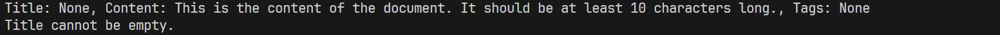

## 3. 文档验证器 - 实现一个文档输入验证类，验证并清理文档的标题(非空)、内容(10-1000000字符)和标签(可选)
```python
class DocumentValidator:
    def __init__(self, title, content, tags=None):
        self._title = title
        self._content = content
        self._tags = tags

    @property
    def title(self):
        return self._title

    @title.setter
    def title(self, value):
        if not value:
            raise ValueError("Title cannot be empty.")
        self._title = value.strip()

    @property
    def content(self):
        return self._content

    @content.setter
    def content(self, value):
        if not (10 <= len(value) <= 1000000):
            raise ValueError("Content must be between 10 and 1,000,000 characters.")
        self._content = value.strip()

    @property
    def tags(self):
        return self._tags

    @tags.setter
    def tags(self, value):
        if value is not None:
            self._tags = ', '.join(value).strip()
        else:
            self._tags = None

    def clean(self):
        # 这里可以添加更多的清理逻辑，比如去除特殊字符等
        return {
            'title': "",
            'content': None,
            'tags': None
        }

# 测试代码
try:
    doc = DocumentValidator(title = None, content = "This is the content of the document. It should be at least 10 characters long.")
    print(f"Title: {doc.title}, Content: {doc.content}, Tags: {doc.tags}")
    doc.title = None
    cleaned_doc = doc.clean()
    print(cleaned_doc)
except ValueError as e:
    print(e)
```

- 程序运行截图
