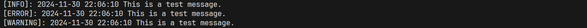

## 4. 简单日志系统 - 创建一个日志类，支持记录带时间戳的操作日志和错误日志到指定文件
```python
import time
import os


class Log:
    def __init__(self, message, log_file):
        self._message = message
        self._log_file = log_file

    def log_info(self):
        with open(self._log_file, 'a') as f:
            f.write(f'[INFO]: {time.strftime("%Y-%m-%d %H:%M:%S", time.localtime())} {self._message}\n')

    def log_error(self):
        with open(self._log_file, 'a') as f:
            f.write(f'[ERROR]: {time.strftime("%Y-%m-%d %H:%M:%S", time.localtime())} {self._message}\n')
    
    def log_warning(self):
        with open(self._log_file, 'a') as f:
            f.write(f'[WARNING]: {time.strftime("%Y-%m-%d %H:%M:%S", time.localtime())} {self._message}\n')


# 测试代码
if __name__ == '__main__':
    log = Log('This is a test message.', 'test.log')
    log.log_info()
    log.log_error()
    log.log_warning()
    os.system('cat test.log')
```

- 程序运行截图
